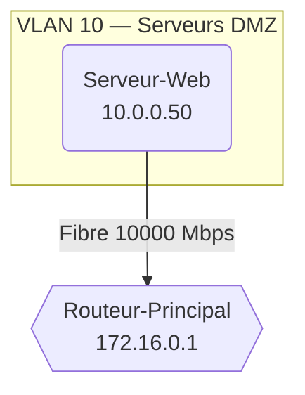

# Gestionnaire et Analyseur d'Adresses Réseau

Ce projet est une application Java permettant de modéliser une infrastructure réseau, de calculer automatiquement les informations de sous-réseau (adresse réseau, broadcast, nombre d'hôtes) et de générer des rapports d'analyse complets, enrichis d'une topologie Mermaid et d'une analyse IA optionnelle, exportés en **Markdown** et/ou en **PDF**.

## Fonctionnalités

- **Calculs réseau avancés** : Détermination de l'adresse réseau, de l'adresse de broadcast et de la capacité d'hôtes à partir d'une IP et d'un masque (notation décimale ou préfixe CIDR).
- **Manipulation binaire** : Stockage optimisé des adresses sous forme d'entiers (`int`) et conversions fluides en chaînes lisibles (ex. `192.168.1.1`).
- **Gestion des VLANs** : Association d'un identifiant VLAN à chaque équipement, avec regroupement automatique dans le rapport.
- **Modélisation des connexions réseau** : Déclaration des liaisons physiques entre équipements avec type de connexion et débit (Mbps).
- **Topologie Mermaid** : Génération automatique d'un diagramme `graph TD` avec sous-graphes par VLAN et styles colorés selon le type d'équipement (routeur, serveur, poste).
- **Analyse IA** : Analyse optionnelle de l'infrastructure via **Gemini** (Google AI) ou **OpenRouter**, avec choix de la longueur de réponse (court / moyen / long).
- **Métadonnées** : Saisie interactive du titre, de l'auteur, de l'entreprise et de la version pour personnaliser l'en-tête du rapport.
- **Export multi-format** :
  - Rapport de synthèse `rapport_statistiques.md` (Markdown).
  - Rapport `rapport_statistiques.pdf` (PDF stylisé via OpenPDF).

---

## Exemple de Rapport Généré

L'application produit un tableau de bord Markdown structuré comme suit :

### Informations sur le document
> **Auteur :** Employer
> **Entreprise :** L'entreprise
> **Version :** v1.1
> **Date de génération :** 2026-06-25

### Topologie Réseau (extrait)


### Indicateurs Clés
- **Nombre total d'équipements enregistrés :** 13
- **Capacité totale d'adresses hôtes disponibles :** 67 241 702

### Répartition par Type d'Équipement
| Type d'appareil | Quantité | Pourcentage |
| :--- | :---: | :---: |
| Ordinateur | 5 | 38,5 % |
| Serveur | 4 | 30,8 % |
| Routeur | 2 | 15,4 % |
| Imprimante | 1 | 7,7 % |
| Borne WiFi | 1 | 7,7 % |

---

## Structure du Projet

```
projet/
├── App.java                 # Point d'entrée — orchestration complète
├── AdresseReseau.java       # Modèle de données — calculs réseau et sérialisation JSON
├── ConnexionReseau.java     # Modèle d'une liaison physique entre deux équipements
├── ConfigurationReseau.java # Générateur du plan réseau
├── MermaidGenerator.java    # Générateur de diagrammes Mermaid (topologie)
├── ExportPDF.java           # Convertisseur Markdown → PDF (via OpenPDF)
└── Metadonnees.java         # Données de l'en-tête du rapport (auteur, version, etc.)
```

### Description des classes

| Classe | Rôle |
| :--- | :--- |
| `App` | Point d'entrée. Orchestre la saisie utilisateur, la déclaration des équipements et connexions, le calcul des statistiques, la construction du Markdown, l'appel IA et l'export des fichiers. |
| `AdresseReseau` | Modèle principal. Stocke l'IP et le masque en `int`, calcule adresse réseau, broadcast et nombre d'hôtes, gère le VLAN et expose `toJson()`. |
| `ConnexionReseau` | Représente une liaison physique entre deux `AdresseReseau` avec un type (Fibre, Ethernet, WiFi) et un débit en Mbps. |
| `MermaidGenerator` | Génère le bloc `graph TD` Mermaid : nœuds hors VLAN, `subgraph` par VLAN, connexions étiquetées, et directives `classDef` / `class`. |
| `ExportPDF` | Convertit le rapport Markdown en PDF A4 via OpenPDF. Gère H1/H2, listes, blocs de code, blockquotes et tableaux. |
| `Metadonnees` | Conteneur simple pour le titre, l'auteur, l'entreprise, la version et la date de génération du rapport. |

---

## Intégration IA

L'application propose trois moteurs au choix lors de l'exécution :

| Option | Modèle | Variable d'environnement requise |
| :---: | :--- | :--- |
| 1 | Gemini 2.5 Flash-Lite | `GOOGLE_API_KEY` |
| 2 | Gemini 3.1 Flash-Lite *(recommandé)* | `GOOGLE_API_KEY` |
| 3 | OpenRouter Free | `OPENROUTER_API_KEY` |
| 0 | Aucune analyse IA | — |

Pour les modèles Gemini, trois longueurs de réponse sont disponibles : **Court** (~200 tokens), **Moyen** (500 tokens) et **Long** (1000 tokens). L'analyse est ajoutée en fin de rapport sous la section `## Analyse IA`.

> **Note :** Si l'analyse IA échoue (clé absente ou erreur réseau), aucun fichier n'est exporté.

---

## Installation et Utilisation

### Prérequis

- **Java 17** ou version supérieure.
- **Maven** pour la gestion des dépendances.

### Dépendances Maven (extrait `pom.xml`)

```xml
<!-- Google GenAI SDK (Gemini) -->
<dependency>
    <groupId>com.google.genai</groupId>
    <artifactId>google-genai</artifactId>
</dependency>

<!-- Gson (parsing JSON OpenRouter) -->
<dependency>
    <groupId>com.google.code.gson</groupId>
    <artifactId>gson</artifactId>
</dependency>

<!-- OpenPDF (export PDF) -->
<dependency>
    <groupId>com.github.librepdf</groupId>
    <artifactId>openpdf</artifactId>
</dependency>
```

### Compilation et Exécution

1. **Cloner le dépôt** :
   ```bash
   git clone https://github.com/Oga-wi/projet-integratif.git
   cd projet-integratif
   ```

2. **Définir les variables d'environnement** *(si analyse IA souhaitée)* :
   ```bash
   export GOOGLE_API_KEY="votre_clé_google"
   # ou
   export OPENROUTER_API_KEY="votre_clé_openrouter"
   ```

3. **Compiler et exécuter via Maven** :
   ```bash
   mvn compile
   mvn exec:java -Dexec.mainClass="projet.App"
   ```

### Déroulement Interactif

L'application guide l'utilisateur par une série de menus :

```
=== Voulez vous ajoutez des métadonnées ? ===
1. Oui
2. Non

=== Choisissez le modèle d'analyse IA ===
1. Gemini 2.5 Flash-Lite
2. Gemini 3.1 Flash-Lite [RECOMMANDER]
3. OpenRouter Free
0. Aucune analyse IA

=== Taille maximale du résumé (Tokens de sortie) ===
1. Court  (~200 tokens)
2. Moyen  (500 tokens)
3. Long   (1000 tokens)

=== Choisissez le format d'export ===
1. Markdown uniquement (.md)
2. PDF uniquement      (.pdf)
3. Les deux            (.md + .pdf)
```

### Fichiers Générés

| Fichier | Description |
| :--- | :--- |
| `rapport_statistiques.md` | Rapport complet en Markdown (topologie, statistiques, tableaux, analyse IA) |
| `rapport_statistiques.pdf` | Version PDF mise en page du même rapport |

---

## Conventions de Code

- Les adresses IP et masques sont stockés en `int` (manipulation bit à bit via `>>>`, `&`, `\|`, `~`).
- Les identifiants Mermaid sont sanitizés via `MermaidGenerator.sanitizeId()` (remplacement de tout caractère non alphanumérique par `_`).
- Le rapport est construit via un `StringBuilder` unique dans `App.main()`, passé ensuite à `ExportPDF.exporter()`.
- Les métadonnées sont optionnelles : si non renseignées, le rapport prend le titre par défaut `Tableau de Bord & Statistiques Réseau`.
