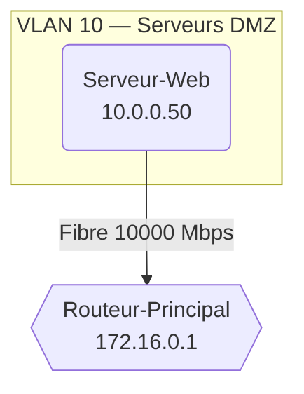

# Network Address Manager & Analyser

This project is a Java application for modelling a network infrastructure, automatically computing subnet information (network address, broadcast, host count) and generating comprehensive analysis reports, enriched with a Mermaid topology diagram and an optional AI analysis, exported as **Markdown** and/or **PDF**.

## Features

- **Advanced network calculations**: Determines network address, broadcast address and host capacity from an IP and a mask (decimal notation or CIDR prefix).
- **Binary manipulation**: Optimised storage of addresses as `int` values with seamless conversion to human-readable strings (e.g. `192.168.1.1`).
- **VLAN management**: Associates a VLAN ID with each device, with automatic grouping in the generated report.
- **Network connection modelling**: Declares physical links between devices with connection type and bandwidth (Mbps).
- **Mermaid topology**: Automatically generates a `graph TD` diagram with per-VLAN subgraphs and colour-coded styles by device type (router, server, workstation).
- **AI analysis**: Optional infrastructure analysis via **Gemini** (Google AI) or **OpenRouter**, with configurable response length (short / medium / long).
- **Metadata**: Interactive input of title, author, company and version to customise the report header.
- **Multi-format export**:
  - Summary report `rapport_statistiques.md` (Markdown).
  - Report `rapport_statistiques.pdf` (styled PDF via OpenPDF).

---

## Sample Generated Report

The application produces a structured Markdown dashboard as follows:

### Document Information
> **Author:** Employer
> **Company:** L'entreprise
> **Version:** v1.1
> **Generated on:** 2026-06-25

### Network Topology (excerpt)


### Key Indicators
- **Total registered devices:** 13
- **Total available host addresses:** 67,241,702

### Device Type Breakdown
| Device Type | Count | Percentage |
| :--- | :---: | :---: |
| Workstation | 5 | 38.5% |
| Server | 4 | 30.8% |
| Router | 2 | 15.4% |
| Printer | 1 | 7.7% |
| Wi-Fi AP | 1 | 7.7% |

---

## Project Structure

```
projet/
├── App.java               # Entry point — full orchestration
├── AdresseReseau.java     # Data model — network calculations and JSON serialisation
├── ConnexionReseau.java   # Model for a physical link between two devices
├── MermaidGenerator.java  # Mermaid diagram generator (topology)
├── ExportPDF.java         # Markdown → PDF converter (via OpenPDF)
└── Metadonnees.java       # Report header data (author, version, etc.)
```

### Class Descriptions

| Class | Role |
| :--- | :--- |
| `App` | Entry point. Orchestrates user input, device and connection declarations, statistics computation, Markdown construction, AI call and file export. |
| `AdresseReseau` | Core model. Stores IP and mask as `int`, computes network address, broadcast and host count, manages VLAN and exposes `toJson()`. |
| `ConnexionReseau` | Represents a physical link between two `AdresseReseau` instances with a connection type (Fibre, Ethernet, Wi-Fi) and a bandwidth in Mbps. |
| `MermaidGenerator` | Generates the Mermaid `graph TD` block: non-VLAN nodes, per-VLAN `subgraph`, labelled connections, and `classDef` / `class` directives. |
| `ExportPDF` | Converts the Markdown report to an A4 PDF via OpenPDF. Handles H1/H2, lists, code blocks, blockquotes and tables. |
| `Metadonnees` | Simple container for the report title, author, company, version and generation date. |

---

## AI Integration

The application offers three engines to choose from at runtime:

| Option | Model | Required environment variable |
| :---: | :--- | :--- |
| 1 | Gemini 2.5 Flash-Lite | `GOOGLE_API_KEY` |
| 2 | Gemini 3.1 Flash-Lite *(recommended)* | `GOOGLE_API_KEY` |
| 3 | OpenRouter Free | `OPENROUTER_API_KEY` |
| 0 | No AI analysis | — |

For Gemini models, three response lengths are available: **Short** (~200 tokens), **Medium** (500 tokens) and **Long** (1000 tokens). The analysis is appended to the report under the `## AI Analysis` section.

> **Note:** If the AI analysis fails (missing key or network error), no output file is exported.

---

## Installation & Usage

### Prerequisites

- **Java 17** or higher.
- **Maven** for dependency management.

### Maven Dependencies (excerpt from `pom.xml`)

```xml
<!-- Google GenAI SDK (Gemini) -->
<dependency>
    <groupId>com.google.genai</groupId>
    <artifactId>google-genai</artifactId>
</dependency>

<!-- Gson (JSON parsing for OpenRouter) -->
<dependency>
    <groupId>com.google.code.gson</groupId>
    <artifactId>gson</artifactId>
</dependency>

<!-- OpenPDF (PDF export) -->
<dependency>
    <groupId>com.github.librepdf</groupId>
    <artifactId>openpdf</artifactId>
</dependency>
```

### Build & Run

1. **Clone the repository**:
   ```bash
   git clone https://github.com/Oga-wi/projet-integratif.git
   cd projet-integratif
   ```

2. **Set environment variables** *(if AI analysis is desired)*:
   ```bash
   export GOOGLE_API_KEY="your_google_key"
   # or
   export OPENROUTER_API_KEY="your_openrouter_key"
   ```

3. **Compile and run via Maven**:
   ```bash
   mvn compile
   mvn exec:java -Dexec.mainClass="projet.App"
   ```

### Interactive Flow

The application guides the user through a series of prompts:

```
=== Would you like to add metadata? ===
1. Yes
2. No

=== Choose the AI analysis model ===
1. Gemini 2.5 Flash-Lite
2. Gemini 3.1 Flash-Lite [RECOMMENDED]
3. OpenRouter Free
0. No AI analysis

=== Maximum summary length (output tokens) ===
1. Short  (~200 tokens) — quick overview
2. Medium (500 tokens)  — balanced detail
3. Long   (1000 tokens) — detailed analysis

=== Choose the export format ===
1. Markdown only (.md)
2. PDF only      (.pdf)
3. Both          (.md + .pdf)
```

### Generated Files

| File | Description |
| :--- | :--- |
| `rapport_statistiques.md` | Full Markdown report (topology, statistics, tables, AI analysis) |
| `rapport_statistiques.pdf` | Formatted PDF version of the same report |

---

## Code Conventions

- IP addresses and masks are stored as `int` values (bitwise operations via `>>>`, `&`, `|`, `~`).
- Mermaid node IDs are sanitised by `MermaidGenerator.sanitizeId()` (all non-alphanumeric characters replaced by `_`).
- The report is built through a single `StringBuilder` in `App.main()`, then passed to `ExportPDF.exporter()`.
- Metadata is optional: if not provided, the report defaults to the title `Tableau de Bord & Statistiques Réseau`.
